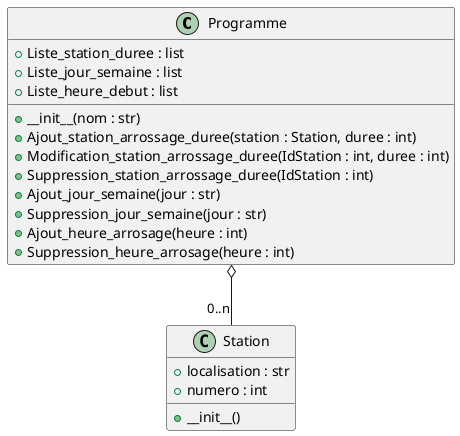

# Diagramme de classe

```puml
@startuml

class Programme {
    + __init__(nom : str)
    + Liste_station_duree : list
    + Liste_jour_semaine : list
    + Liste_heure_debut : list
    + Ajout_station_arrossage_duree(station : Station, duree : int)
    + Modification_station_arrossage_duree(IdStation : int, duree : int)
    + Suppression_station_arrossage_duree(IdStation : int)
    + Ajout_jour_semaine(jour : str)
    + Suppression_jour_semaine(jour : str)
    + Ajout_heure_arrosage(heure : int)
    + Suppression_heure_arrosage(heure : int)
}

class Station{
    +__init__()
    + localisation : str
    + numero : int
}

Programme o-- "0..n" Station

@enduml
```